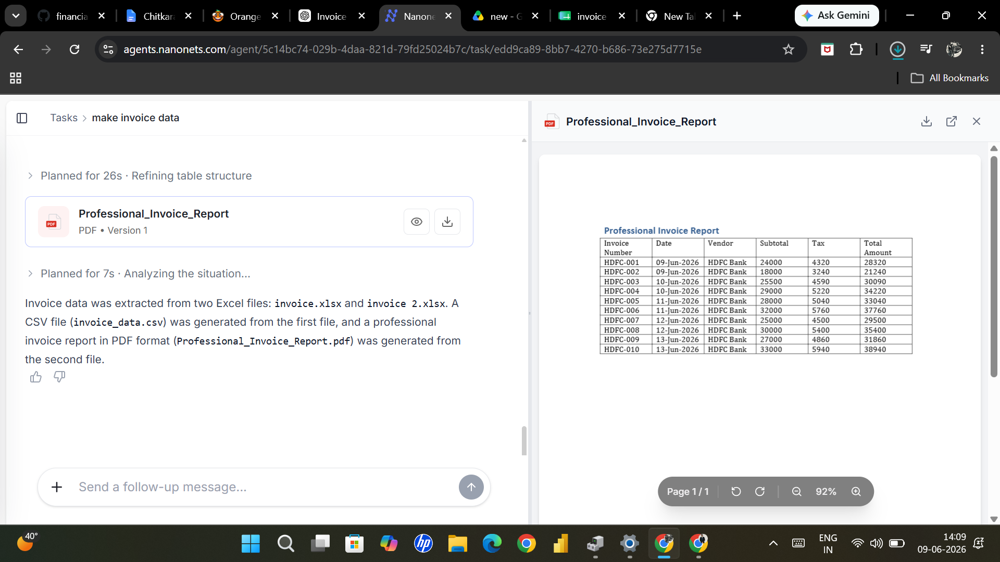
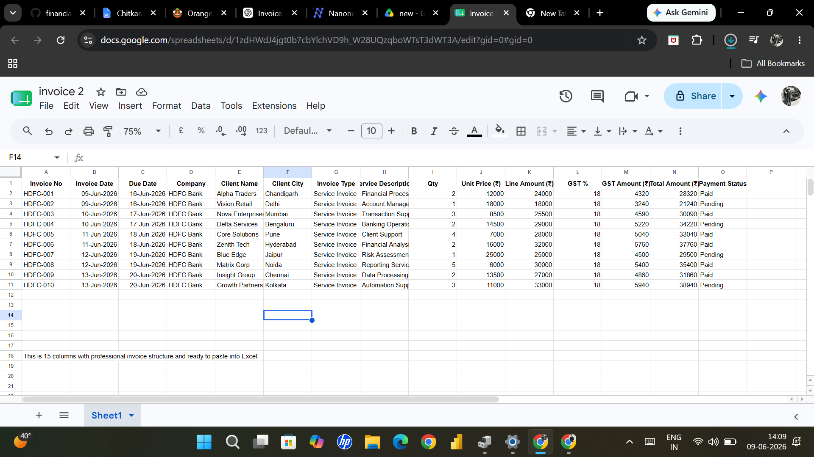

# 📸 Invoice Dataset & Automated Report Demonstration

---

## 📊 Invoice Dataset (Google Sheets)

<p align="center">

</p>

The invoice dataset was created and maintained in Google Sheets to simulate professional financial invoice processing.

### Highlights

* Structured invoice records
* Financial calculations included
* GST computation
* Client information management
* Payment tracking support
* Automation-ready dataset

---

## 📁 Source Excel Dataset

<p align="center">

</p>

The Excel dataset was used for invoice storage, reporting, and workflow automation.

### Features

* Structured financial records
* Business reporting
* Financial calculations
* Organized invoice management

---

## 📄 Professional Invoice Report

<p align="center">

</p>

Professional invoice reports were automatically generated from invoice data.

### Report Includes

* Invoice Number
* Date
* Vendor
* GST Calculation
* Total Amount
* Payment Status

---

# 🔄 Automation Flow

```text
Google Sheets / Excel
          ↓
Invoice Extraction
          ↓
Data Validation
          ↓
Invoice Generation
          ↓
PDF Report Output
```
